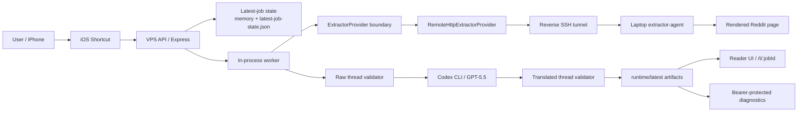
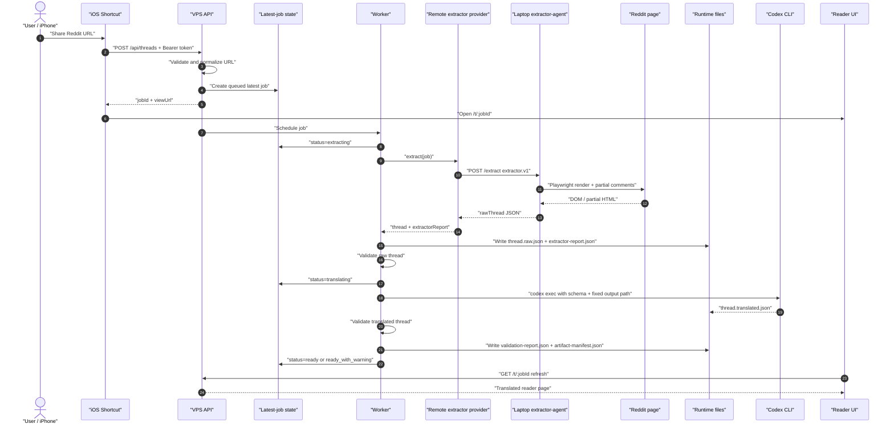
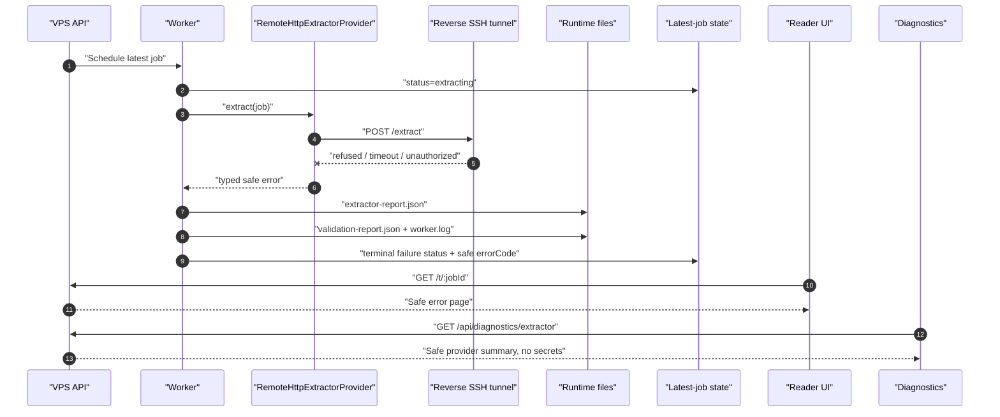
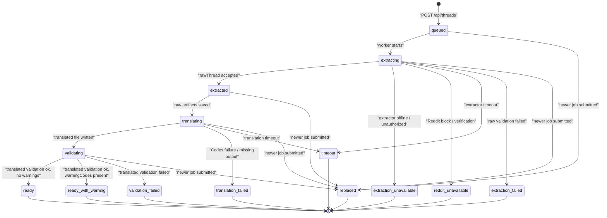
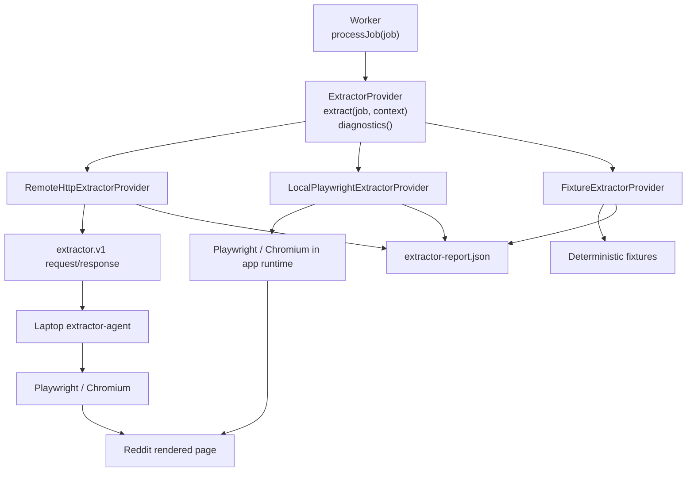
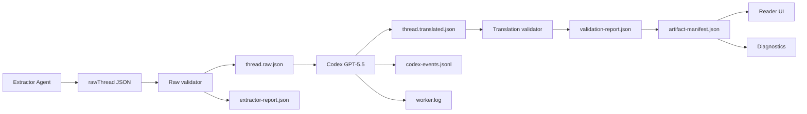
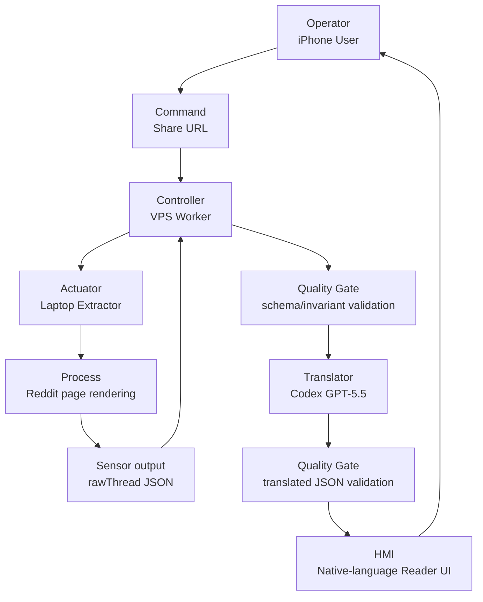
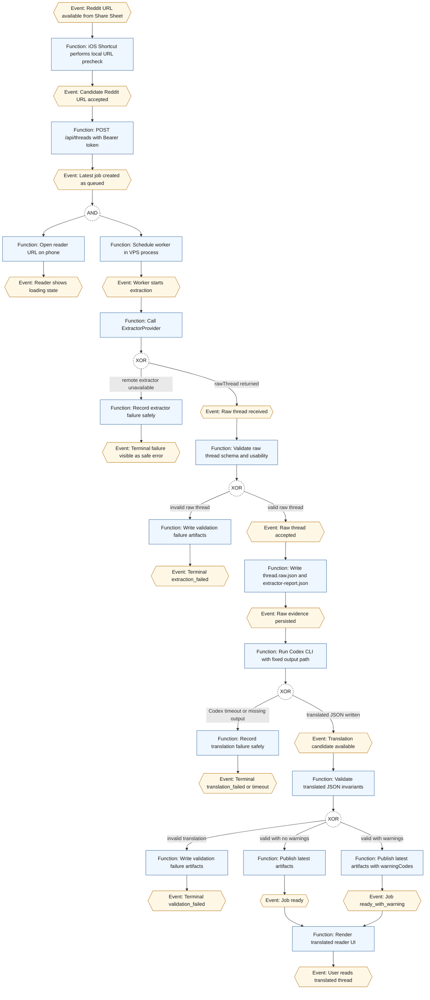

# Architecture Visuals

Status: educational architecture notes for the current Reddit Reader MVP.

This page explains the current implementation shape with diagrams. It is not a new product promise, not deployment approval, not owner Acceptance, and not a replacement for source code, tests, or ops handoff notes.

## 1. System Overview

The accepted runtime splits Reddit extraction from translation/rendering. The laptop performs browser-render extraction because direct VPS Reddit access may be blocked. The VPS remains the product runtime for API, state, validation, Codex translation, artifacts, diagnostics, and reader UI.

Key idea: the laptop is an extractor station, not a second app server and not a translator. Codex/OpenAI translation stays on the VPS runtime.

## 2. Normal Successful Job

This is the happy path when the laptop extractor-agent and reverse tunnel are active, Reddit extraction succeeds, and Codex writes the translated JSON to the fixed output path.

Important invariant: `ready_with_warning` is still a successful terminal state. For example, `partial_comments` means the reader result is usable but extraction could not prove all comment expansion was complete.

## 3. Extractor Unavailable Failure

The extractor path should fail quickly and safely when the reverse tunnel or laptop agent is unavailable. It should not poll continuously or expose internal logs/secrets to the reader.

Typical safe outcomes:

- `extraction_unavailable` + `extractor_unavailable`
- `extraction_unavailable` + `extractor_unauthorized`
- `timeout` + `extractor_timeout`
- `reddit_unavailable` + `reddit_verification_or_block_page`

## 4. Job State Machine

The app is a single-slot latest-job system. A new job replaces the previous one. Scratch work directories are discarded after publish or stale-job detection.

Operational note: smoke scripts must stop on both `ready` and `ready_with_warning`.

## 5. Extractor Provider Boundary

The provider boundary lets the worker stay stable while extraction placement changes.

Why this matters: `remote-http` is a deployment placement choice, not a different product feature. It does not add Reddit OAuth/API, cookies, proxy behavior, or fallback translation.

## 6. Artifact Flow

Artifacts are the evidence trail for one latest job. The reader-facing API only exposes safe translated reader data, while diagnostics and local files hold richer evidence.

Reader-facing rule: `/api/view/:jobId` and `/t/:jobId` must not expose original English bodies, raw HTML, screenshots, worker logs, Codex event logs, or validation internals.

## 7. Control-Loop Analogy

This is not literal industrial control software, but the analogy is useful for understanding the shape of the system: the user issues a command, the worker controls a process, sensors return structured state, quality gates validate, and the UI reports back.

The useful lesson from the analogy: the system becomes easier to reason about when each boundary has a clear signal:

- command: Reddit URL
- sensor output: `rawThread`
- quality gates: schema and invariant validation
- actuator health: extractor diagnostics
- HMI: native-language reader page and safe warning/error states

## 8. EPC Process View

EPC notation describes a process as alternating events and functions, with logical connectors such as AND and XOR. Mermaid does not provide a native EPC renderer, so this diagram uses EPC-compatible conventions:

- events: hexagons
- functions: rectangles
- connectors: circles labeled `AND` or `XOR`

EPC reading tip: events describe facts that have become true, while functions describe work the system performs. The XOR points are where one path is selected: failure, invalid artifact, valid artifact, or successful terminal state.

## Reading Map

- `docs/hybrid-extraction-mode.md`: current laptop/VPS extraction architecture.
- `docs/extractor-protocol-v1.md`: remote extractor request/response contract.
- `docs/ops-production-overrides.md`: deployment-owned production config memory.
- `docs/configuration.md`: environment variables and local defaults.
- `runtime/latest/artifact-manifest.json`: latest runtime artifact inventory when the app has run.
