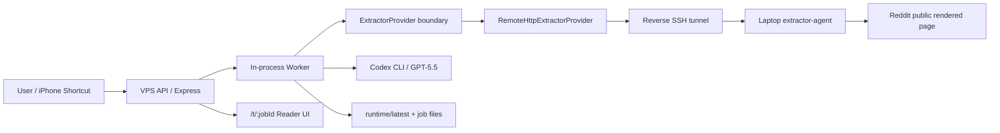
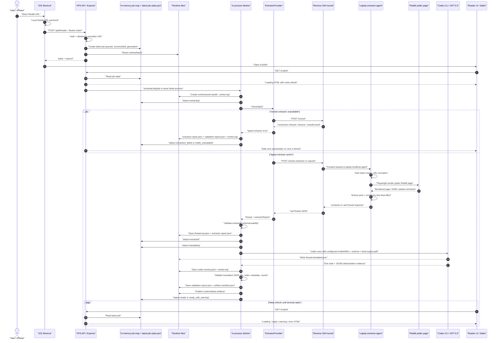

# Hybrid Extraction Mode

Status: current MVP architecture after VPS direct Reddit extraction proved blocked by Reddit verification pages.

The product still has one extraction strategy: unauthenticated browser-render Reddit HTML through Playwright. The hybrid mode changes where that browser extraction runs. It does not add Reddit OAuth/API, cookies, login, proxies, anti-bot behavior, fallback translators, deployment adoption, or archive scope.

## Current Components

## Sequence

## Before And After

Before this refactor, the app selected extraction by calling either direct Playwright code or a remote HTTP helper from the worker. The behavior was working, but the boundary was implicit.

After this refactor, the worker calls an `ExtractorProvider` interface. Current providers:

- `RemoteHttpExtractorProvider`: VPS calls a private endpoint, usually through reverse SSH to the laptop agent.
- `LocalPlaywrightExtractorProvider`: app process performs local Playwright extraction directly.
- `FixtureExtractorProvider`: tests inject deterministic extraction.

The provider boundary makes extraction placement explicit while preserving the existing product promise: one latest Reddit thread, translated native-language reader page, no original-text display, no Reddit account actions, and no alternate translator.

## Limits

- The laptop extractor-agent must be running and reachable through the private tunnel for hybrid extraction.
- Direct VPS Playwright extraction remains runtime-specific and may be blocked by Reddit.
- The remote provider has a small local circuit breaker for repeated extractor failures. It is process-local, not durable, and only prevents repeated immediate calls during the configured cooldown.
- The app plus worker still run in one Node process for MVP simplicity. A separate worker process can be a future work order if throughput, isolation, or restart semantics become important.
- SQLite is still not used. Latest-job state remains file-backed plus in-memory, which fits the single-slot MVP.
